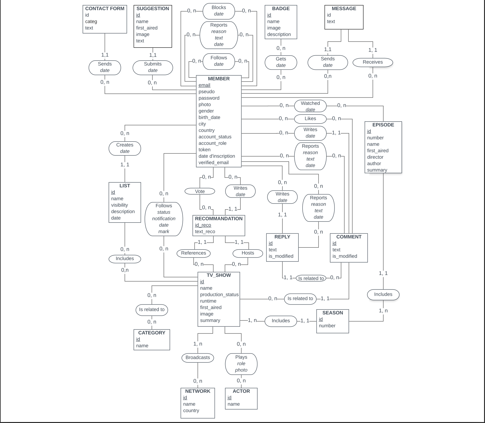

# Projet Annuel ESGI 2019

Une application de tracking d'avancement de film / serie

## MCD

## I. FRONT OFFICE

### Navbar

Présente sur toutes les pages, contient :

- Pour tous :
- Une recherche rapide : séries, acteurs et membres
- Un lien vers la page de recherche avancée
- Un lien vers la page « Surprenez-moi » : renvoie vers une fiche série aléatoire
- Un lien « Contact » : ouvre directement un e-mail à destination de
contact@flixadvisor.fr
- Si déconnecté :
- Bouton d’inscription
- Bouton de déconnexion
- Si connecté :
- Bouton de déconnexion
- Bouton d’accès aux paramètres
- Bouton d’accès à son profil
- Bouton d’accès à la messagerie
- Bouton pour contacter les administrateurs
- Si administrateur : bouton vers le back office
Création de compte
- Informations obligatoires : pseudonyme, e-mail, mot de passe, confirmation du mot de
passe, captcha
- Informations optionnelles : âge, genre, ville, pays, date de naissance
- Envoi d’un email afin de confirmer l’adresse email : un clic sur le lien unique contenu dans
l’email confirme l’adresse e-mail et permet de se connecter
Connexion
- Vérification de la paire e-mail/mot de passe
- Mot de passe oublié : réception d’un mot de passe fort généré aléatoirement par e-mail
Page d’accueil
- Carrousel des séries les plus vues : les séries qui sont suivies par le plus de membres
- Carrousel des séries les mieux notées : les séries ayant la meilleure moyenne de notes
attribuées par les utilisateurs
- Carrousel des séries les plus récentes : les séries dont un épisode a été ajouté le plus
récemment
- Carrousel de recommandations personnalisées : en fonction des séries suivies par
l’utilisateur, proposition de séries avec des genres similairesPage série
- Pour tous :
  - Statistiques de la série : titre, rang, score, nombre de membres qui suivent la série
  - Image de la série
  - Informations détaillées de la série : nombre d’épisodes, nombre de saisons, durée
moyenne d’un épisode, statut de la série (en cours ou terminée), date de diffusion,
chaîne de diffusion, genres
  - Synopsis de la série
  - Listes des épisodes : un clic affiche le résumé de l’épisode
  - Casting de la série : chaque nom d’acteur est cliquable et renvoie vers une recherche
  qui affiche toutes les séries dans lesquelles il joue
  - Liste des commentaires des membres avec nombre de « likes » par commentaire :
  les commentaires les plus « likés » s’affichent en premier, puis par ordre
  chronologique du plus récent au plus ancien
  - Pour les membres connectés :
  - Possibilité d’écrire un commentaire : un bouton « cacher un spoil » est disponible
  pour qu’à l’affichage, la partie sélectionnée s’affiche en noir sur fond noir
  - Possibilité de voter pour un commentaire : un nouveau clic sur le bouton permet
  d’annuler le vote
  - Bouton d’ajout à une liste personnalisée : possibilité de créer la liste personnalisée
  directement depuis l’interface
  - Pour les membres connectés ne suivant pas la série :
  - Bouton de suivi de la série : ajout dans une liste « à voir », « en cours » ou
  « terminée »
  - Si connectés en ayant suivi la série :
  - Possibilité de noter la série
  - Changement du statut de suivi de la série : en cours, à voir, terminé
  - Bouton pour ne plus suivre la série
  - Bouton pour activer / désactiver les notifications
  - Bouton pour marquer un épisode comme vu / non vu
  - Bouton pour marquer tous les épisodes en vus / non vus
### Page profil
- Pour tous :
- Affichage des informations basiques : pseudonyme, photo de profil, date de création
de compte, rôle sur le site (utilisateur ou administrateur)
- Affichage des séries suivies par le membre
- Recherche rapide
- Filtre par statut de visionnage : à voir, en cours ou terminé
- Affichage des listes publiques créées par l’utilisateur
- Nom de la liste
- Description de la liste
- Date de création de la liste
- Nombre de séries contenues dans la liste
- Recherche rapide parmi les séries de la liste
- Liste des séries ajoutées avec image, nom, date de diffusion, synopsis et
genres
- Pour le membre connecté et les administrateurs :
- Accès aux listes privées
- Possibilité de créer une nouvelle liste
- Possibilité de supprimer une listePage paramètres
- Affichage des informations ajoutées par le membre à la création du compte
- Possibilité de modifier toutes les informations ajoutées à l’inscription, sauf l’adresse e-mail
- Ajout d’une photo de profil
- Dessin de sa propre photo de profil
### Page recherche avancée
- Recherche de séries pouvant associer plusieurs critères : nom, acteurs, statut de production,
note moyenne, durée moyenne d’un épisode, genres, chaîne de diffusion, date de première
diffusion
- Affichage des résultats avec le nom de la série, l’image, le synopsis, le statut de production,
le nombre de membres qui suivent la série et la durée moyenne d’un épisode
## II. BACK OFFICE

Accessible uniquement aux administrateurs

###  Page Gestion des membres

- Onglet « Gestion des membres »
- Affichage de tous les membres inscrits : e-mail, pseudonyme, date de création de
compte, rôle
- Possibilité de modifier les informations d’un compte (tout sauf l’adresse e-mail),
supprimer un compte et bannir un compte
- Le bannissement peut-être définitif ou en nombre de jours : le membre ne pourra
plus se connecter
- Possibilité d’exporter la liste au format CSV
- Onglet « Création d’un membre »
- Email, pseudonyme et rôle sont obligatoires
- Les autres valeurs sont optionnelles
- Onglet « Membres bannis »
- Liste des membres bannis : e-mail, pseudonyme, date de création de compte, type
de bannissement (permanent ou temporaire), date de bannissement, durée de
bannissement
- Bouton pour désactiver le bannissement
Page Séries
- Onglet « Gestion des séries »
- Liste des séries : nom, année de première diffusion, statut de production, nombre
d’épisode, date de la dernière modification
- Recherche rapide
- Bouton « Update Hard » : met à jour toutes les séries de la base de données via l’API
The TV Data Base
- Bouton « Update Light » : met à jour toutes les séries de la base de données via l’API
The TV Data Base si une modification à eu lieu il y a moins de 30 jours
- Bouton pour faire un « Update Hard » pour une seule série
- Bouton pour faire un « Update Light » pour une seule série
- Bouton pour modifier une série : nom de la série, date de première diffusion, statut
de production, image, identifiant de la série (consultable uniquement), durée
moyenne des épisodes, synopsis
- Bouton pour supprimer une série de la base de donnéesPage Contacts
- Regroupement sous forme de conversations de messages envoyés par les membres via le
bouton « Contactez-nous »
- Affichage de l’e-mail du membre et de la date d’envoi des messages
- Une réponse envoyée par un administrateur arrive dans la boîte de réception d’un membre
via le profil « Admin »

### Page Statistiques

- Onglet « Statistiques utilisateurs » :
- Regroupe des informations sur les membres inscrits : statistiques par genre, par
pays, par villes et par tranches d’âge
- Onglet « Statistiques séries » :
- Affiche diverses statistiques sur les séries présentes en base de données : nombre de
séries, d’acteurs, d’épisodes, de saisons, de chaînes, division des séries par genre

## III. DROITS ADMINISTRATEURS
- Créer un membre
- Modifier les informations d’un membre
- Supprimer un membre
- Bannir un membre
- Annuler un bannissement
- Ajouter une série
- Supprimer une série
- Mettre à jour une série manuellement ou via l’API
- Répondre aux utilisateurs
- Voir les statistiques du site
- Accéder aux listes personnalisées privées des utilisateurs
